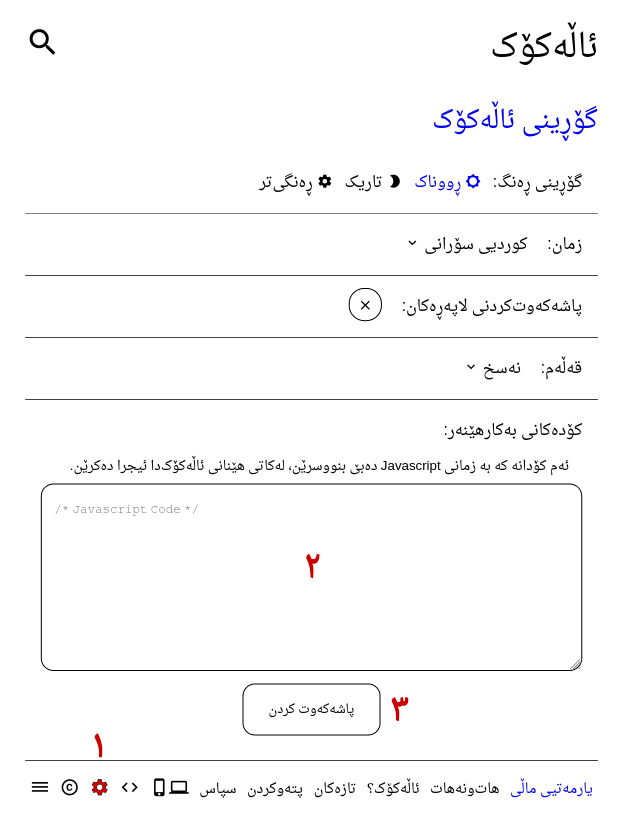

# پەکەیجەکانی ئاڵەکۆک

ئێرە شوێنێکە بۆ دانانی گۆڕانکارییەکانی ماڵپەڕی ئاڵەکۆک.

ئێوەش دەتوانن گۆڕانکارییەکانی خۆتان لێرە دانێن.

# چۆنیەتی بەکارهێنان

ئەگەر هەر یەک لەو پەکەیجانەتان بە دڵ بوو، کۆدەکانی کۆپی کەنە بەشی
"کۆدەکانی بەکارهێنەر" لە لاپەڕەی "گۆڕانکاری" ماڵپەڕی ئاڵەکۆک‌دا و دواتر
لە سەر "پاشەکەوت کردن" کرتە بکەن. لاپەڕەکەی نوێ کەنەوە تا
گۆڕانکارییەکان خۆیان نیشان دەن.

