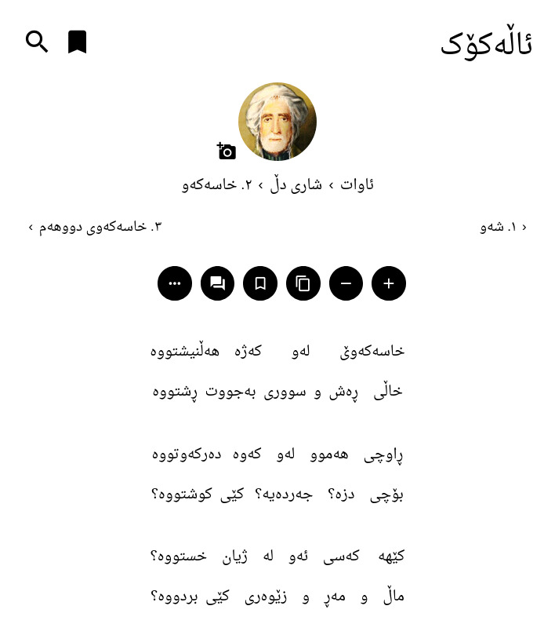

# یەکسان‌کردنی ئەندازەی دێڕەکان
بۆ بەکارهێنانی ئەم پەکەیجە کۆدەکانی فایلی `code.js` کۆپی کەنە بەشی
"کۆدەکانی بەکارهێنەر" لە سەر ماڵپەڕی ئاڵەکۆک.

# کێشەکان
بەداخەوە دوو پەکەیجی `justify-poems` و `transliterate` ناتوانن پێکەوە
بەکار بێنن. ئەوەش هۆیەکەی ناتەواوی کۆدەکانی ئاڵەکۆکە.

# شێوە

